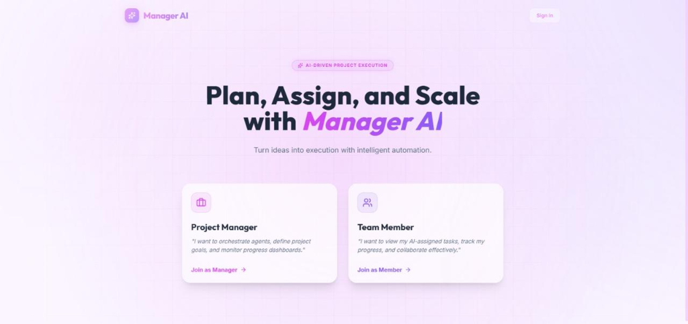
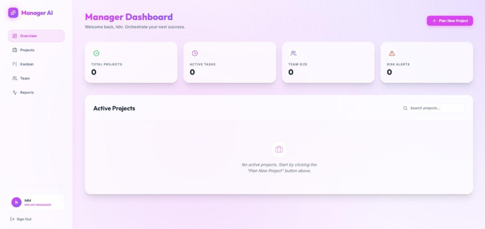
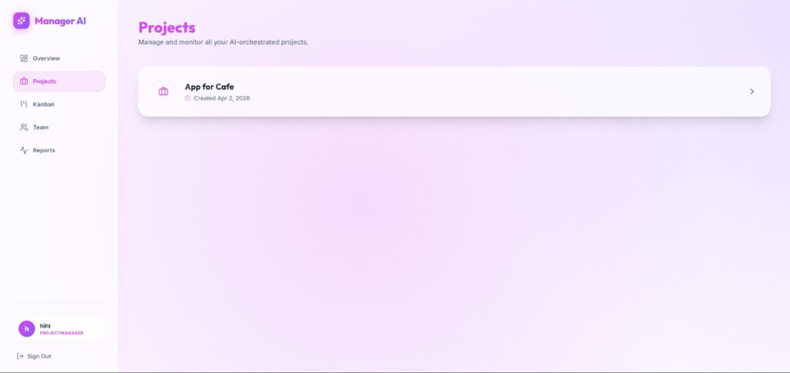
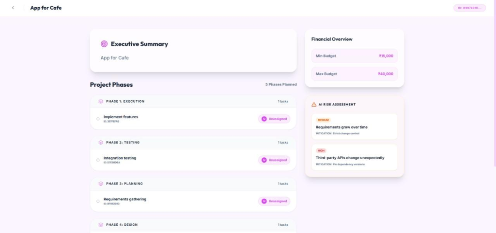
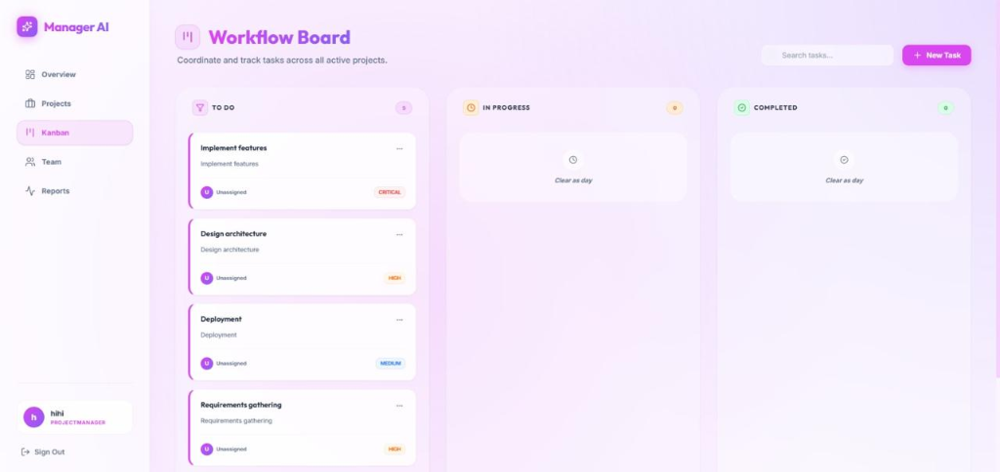

# Manager AI (Plan AI)

Manager AI is an advanced AI-powered multi-agent project planning and management application. It utilizes a robust C# ASP.NET Core backend coupled with a modern React frontend (built with Vite and Tailwind CSS) to help teams structure, optimize, and manage their projects intelligently.

## Features

- **AI Multi-Agent Pipeline:** Features specialized AI agents to handle different aspects of project planning:
  - `CategoryDetectorAgent`: Detects and categorizes project needs.
  - `TaskPlannerAgent`: Automatically breaks down projects into actionable tasks.
  - `RiskAgent`: Identifies potential project risks and mitigation strategies.
  - `OptimizerAgent`: Optimizes task flows and resource allocation.
  - `ResourceAgent`: Manages and suggests resource requirements.
  - `TeamAssignmentAgent`: Suggests optimal team assignments.
- **LLM Integration:** Powered by an OpenAI-compatible API (Groq) for rapid and intelligent text generation and processing.
- **Robust Backend:** Built on .NET 8, featuring Entity Framework Core with a Neon PostgreSQL database.
- **Secure Authentication:** Implements JWT-based authentication for secure user access and data protection.
- **Modern Frontend:** A responsive and fast React frontend utilizing Vite and Tailwind CSS.

## 📸 Product Screenshots

Here is a visual overview of **Manager AI**'s premium, dynamic user interface:

| 🚀 Landing & Portal | 📊 AI Executive Dashboard |
|---|---|
|  |  |

| 📋 Interactive Kanban Board | 📉 High-Impact Reports |
|---|---|
|  |  |

| 👥 Dynamic Team Allocator |
|---|
|  |

## Tech Stack

### Backend
- **Framework:** ASP.NET Core (.NET 8)
- **Database:** PostgreSQL (hosted on Neon)
- **ORM:** Entity Framework Core (`Npgsql.EntityFrameworkCore.PostgreSQL`)
- **AI Integration:** OpenAI API client (configured for Groq)
- **Authentication:** JWT Bearer tokens (`Microsoft.AspNetCore.Authentication.JwtBearer`)
- **API Documentation:** Swagger / OpenAPI

### Frontend
- **Framework:** React
- **Build Tool:** Vite
- **Styling:** Tailwind CSS

## Prerequisites

- [.NET 8 SDK](https://dotnet.microsoft.com/download/dotnet/8.0)
- [Node.js](https://nodejs.org/) (for frontend development)
- PostgreSQL database (or use the provided Neon connection string in `appsettings.json`)
- Groq / OpenAI API Key

## Getting Started

### 1. Clone the repository

```bash
git clone https://github.com/Samikshaa27/Manager-AI.git
cd Manager-AI
```

*(Note: The main code is located in the `Plan Ai updated` directory.)*

### 2. Setup the Backend

1. Navigate to the backend directory:
   ```bash
   cd "Plan Ai updated"
   ```
2. Restore .NET dependencies:
   ```bash
   dotnet restore
   ```
3. Update database connections and API keys in `appsettings.json` (or `appsettings.Development.json`):
   - `ConnectionStrings:DefaultConnection`: Set your PostgreSQL connection string.
   - `OpenAI:ApiKey`: Set your Groq/OpenAI API key.
   - `Auth:JwtSecret`: Set a secure 32+ character JWT secret.
4. Apply database migrations:
   ```bash
   dotnet ef database update
   ```
5. Run the backend:
   ```bash
   dotnet run
   ```
   The API will be available at `http://localhost:5000` (or the port specified by your environment). You can access the Swagger UI at `/swagger` when running in development mode.

### 3. Setup the Frontend

1. Navigate to the frontend directory:
   ```bash
   cd "Plan Ai updated/frontend"
   ```
2. Install dependencies:
   ```bash
   npm install
   ```
3. Set up environment variables (create a `.env` file based on your configuration).
4. Run the frontend development server:
   ```bash
   npm run dev
   ```

## 🔒 Security & Environment Variables

To keep your credentials secure, **never** commit live passwords, database connection strings, or API keys to a public repository. The application supports reading configurations directly from environment variables.

### Local Development Setup
1. Create an `appsettings.Development.json` file in the `Plan Ai updated` root folder (this file is already in `.gitignore` and will never be committed).
2. Populate it with your local secrets:
   ```json
   {
     "ConnectionStrings": {
       "DefaultConnection": "your-neon-connection-string"
     },
     "OpenAI": {
       "ApiKey": "your-groq-api-key"
     },
     "Auth": {
       "JwtSecret": "your-jwt-secret-min-32-chars"
     }
   }
   ```

### Production Deployment (Render / Vercel)
Set the following environment variables in your deployment platform settings (e.g., Render Web Service dashboard, Vercel project settings):

| Variable Name | Description | Example Value |
| :--- | :--- | :--- |
| `ConnectionStrings__DefaultConnection` | Neon PostgreSQL Connection String | `Host=ep-your-database-pooler.onrender.com;...` |
| `OpenAI__ApiKey` | Groq/OpenAI API Key | `gsk_your_groq_api_key` |
| `Auth__JwtSecret` | JWT Secret Key (min 32 characters) | `your-secure-32-character-secret` |

---

## Deployment

The project is configured for deployment with a `render.yaml` file, supporting platforms like Render, Railway, or similar PaaS providers. It also includes a `Dockerfile` for containerized deployment.

## License

This project is open-source and available under the standard MIT License (or specify your license here).
